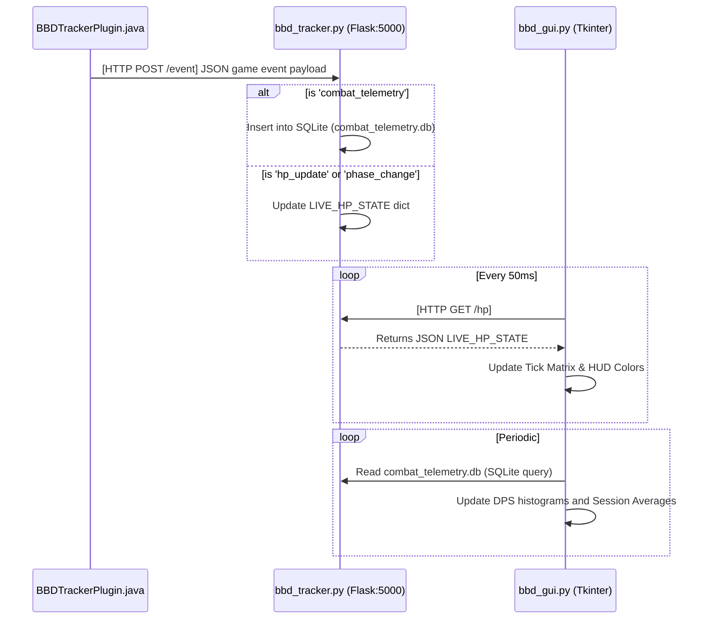

# 🏗️ Codebase State Audit

## 📂 1. Directory Structure Overview
The `k:\osrs-wom-utilities` folder contains a sprawling collection of scripts, data directories, and plot generators. The core components are split between the data collection (Java/Python HTTP Server) and the visual presentation (Tkinter UI).

**Key Directories:**
- `bbd_data/`: Contains JSON files for individual tracked sessions.
- `price_snapshots/`: Contains historical GE price data.
- `item_images/`: Sprites for the inventory/drop icons.
- `plot_scripts/`: Various matplotlib/seaborn scripts for data analysis.

**Key Data stores:**
- `combat_telemetry.db` / `wom_master.db`: SQLite databases storing raw hitsplats and events.
- `gpph_sessions.csv` / `items.csv`: Flat files caching item alchemy values, drop rates, and historical GP/hr.

---

## 🧩 2. Active Components & Entities

### A. The Data Source (`BBDTrackerPlugin.java`)
- **Role:** Hooks into RuneLite client events (Spawn, Hitsplats, Loot, GameTicks).
- **Behavior:** Detects when the player interacts with specific NPCs (e.g., Brutal Black Dragons). Tracks the Dragon's HP, shiny entity spawns, player attacks, and loot received.
- **Outbound Communication:** Acts as an HTTP Client. Packages game events into JSON payloads and fires them as `POST` requests to `http://127.0.0.1:5000/event`.

### B. The Telemetry Server (`bbd_tracker.py`)
- **Role:** Acts as the middleman data sink and session manager.
- **Behavior:** Runs a local Flask web server on port 5000.
  - Listens on `POST /event` to receive live telemetry from Java.
  - Writes durable events (like damage hitsplats) directly into `combat_telemetry.db` (SQLite).
  - Maintains an in-memory `LIVE_HP_STATE` dictionary for highly ephemeral data (current phase, live hp, last attack tick).
  - Exposes a `GET /hp` endpoint for clients to read the current in-memory state.
- **Bonus Role:** Also contains a `customtkinter` UI used for session management, gear configuration, and DPS tracking.

### C. The Visualizer / GUI (`bbd_gui.py`)
- **Role:** The Tkinter overlay presenter. It provides multiple borderless overlay windows mimicking an advanced dashboard (History, Projections, Live Combat Telemetry, Tick Visualizer, Opportunity Cost, etc.).
- **Data Ingestion (Ephemeral):** Runs a continuous 50ms `run_tick_loop` that hits `GET http://127.0.0.1:5000/hp` via `requests` to fetch the live combat state and render the visual tick grid.
- **Data Ingestion (Durable):** Periodically queries `combat_telemetry.db`, `bbd_data/*.json`, and `items.csv` to calculate trailing averages, opportunity costs, and theoretical DPS variance.

---

## 🔀 3. The Data Flow Pipeline

The current pipeline operates as a **Polling/Pull architecture** bridged by HTTP:

### 🚨 Architectural Observations (Pre-Refactor Notes)
1. **High Overhead Polling:** `bbd_gui.py` is spamming a `GET` request every 50ms to localhost. This is functional but inefficient compared to a persistent connection (like WebSockets) or a fast Fire-and-Forget UDP socket.
2. **Duplicate UI Frameworks:** `bbd_tracker.py` uses `customtkinter` for configuration, while `bbd_gui.py` uses raw `tkinter` for the overlay borders. Consolidating these could simplify the app.
3. **Coupling:** The Tkinter UI performs heavy manual synchronous I/O blocking (reading massive JSON/CSV files periodically on the main thread), which can cause frames to drop in the visualizer.
